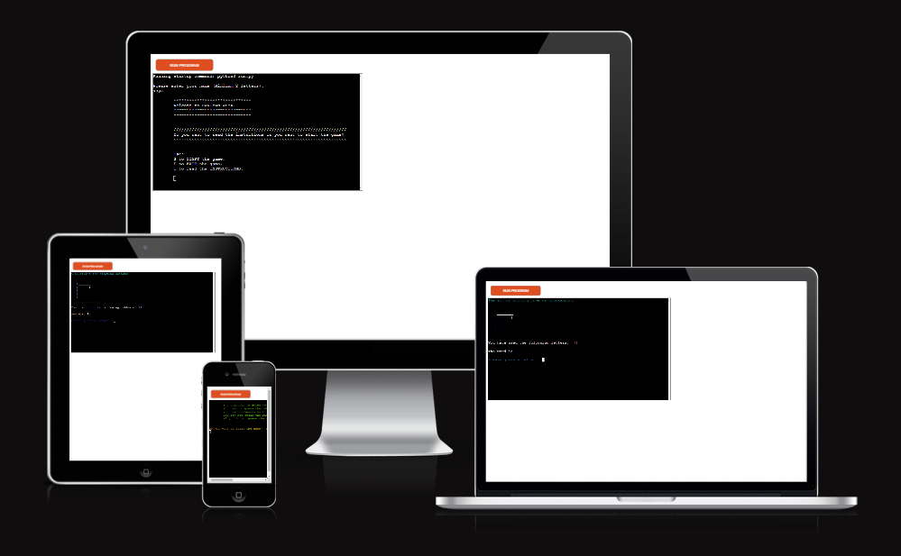

# HANGMAN FOR PROGRAMMERS

Hangman for programmers is a terminal game done by using Python.
The player has 6 attempts to guess the word. With each word there is a shoer introduction to help the player to guess the right letters.

Here is the live version of the game: 
[HANGMAN FOR PROGRAMMERS](https://hangman-for-programmers-1e8bf1b491a5.herokuapp.com/)

## How to play

Hangman for programmers is a game based on the classic hangman game. 

The words are programming related. Each word has a short description to help the player to guess. 

The player has 6 attempts to fail. If they don't guess the word, the man is being hanged.

## Features
### Existing Features
