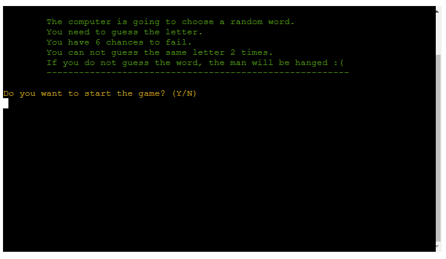

# HANGMAN FOR PROGRAMMERS

Hangman for programmers is a terminal game done by using Python.
The player has 6 attempts to guess the word. With each word there is a shoer introduction to help the player to guess the right letters.

Here is the live version of the game: 
[HANGMAN FOR PROGRAMMERS](https://hangman-for-programmers-1e8bf1b491a5.herokuapp.com/)

## How to play

Hangman for programmers is a game based on the classic hangman game. 

The words are programming related. Each word has a short description to help the player to guess. 

The player has 6 attempts to fail. If they don't guess the word, the man is being hanged.

## Features
### Existing Features

+ Name validation
  + It has a function which validates the name, so it includes only letters and in at least 2 characters long
  + It gives different feedbacks depending on the input

+ Generates a welcome message using the username
  + Asks if the player wants to read the instructions or start the game

+ Validates the input

  + Depending on the input is starts the game, finishes or shows instructions and asks if the player wants to start th game

+ Random word generation
  + The computer generates a random word
  + The playes sees only "_" and it counts the length of the word
  + It shows a short description of the word to help the player

+ Validate input and check the guess
  + If the user guesses wrong it gives a feedback and asks to continue the game

  + If the user guesses right, it shows a message and if there are more letters to guess, the game continues.

+ Check if the user have already guessed the letter.
  + It shows a message if the user has already guessed the letter, without counting it as a wrong guess.

+ The game over function
  + If the man hangs, it shows a message that the game is over and asks if the user wants to play again

+ Goodbye message
  + If the user wishes to end the game, it generates a goodbye message

### Future Features

+ Allow the player to choose a topic and generate words accoringly
+ Allow the player to exit/restart the game in the middle of the game too

## Data Mode and Libraries
The game has one class names Hangman. All the variables are declared in the class. The ones which nedded to have access from more than 2 function are declared in __init__(), the others are decalred locally.
Mostly each function does one thing to make it easier to maintain.
For cleanint the terminal to make the reading easier has been used os and for the colors had been installed Colorama

## Testing
The game has been tested manually by me and friends to make sure that all the validations work as expected.
+ It had been playes multipule times to make sure that the game restarts and resets every time
+ Tested with non valid input to see if it gives the feedback and continues the program without crushing or ending up in an infinite loop
+ The game works on GoogleChrome, Mozilla, Microsoft Edge, however it has a problem with Safari.

## Bugs
### Solved Bugs

+ Most of the errors were related long lines.

All of the has been fixed.

### Remaining Bugs
+ NONE

## Deployment
The project had been deployed by usin Code Institute's mock terminal for Heroku.
Before the deployment colorama has been installed to be able to use in Heroku also.
It had been installed using the command in the terminal "pip3 freeze > requirements.txt"

The steps for deployment were following:
  + Log in to Heroku
  + Create a new app in Heroku
  
  + Name the app and choose the relevant location
  
  + Go to settings
  + Add buildpacks, first Python and next node.js
  
  + Go to deploy
  + Choose a deployment method GitHub
  + Connect to the repository
  + Enable Automatic Deploys to update the project along the coding
  